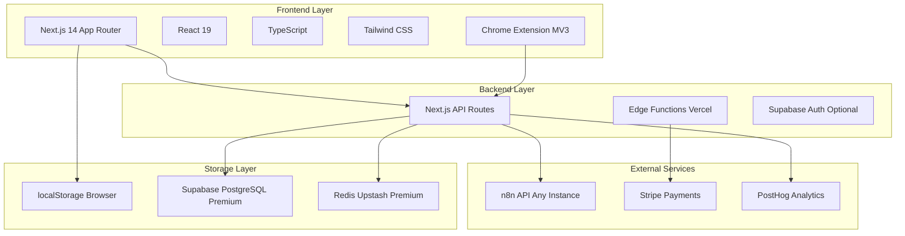
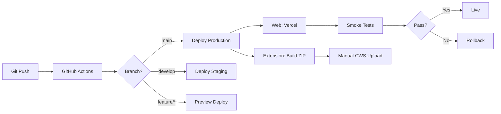
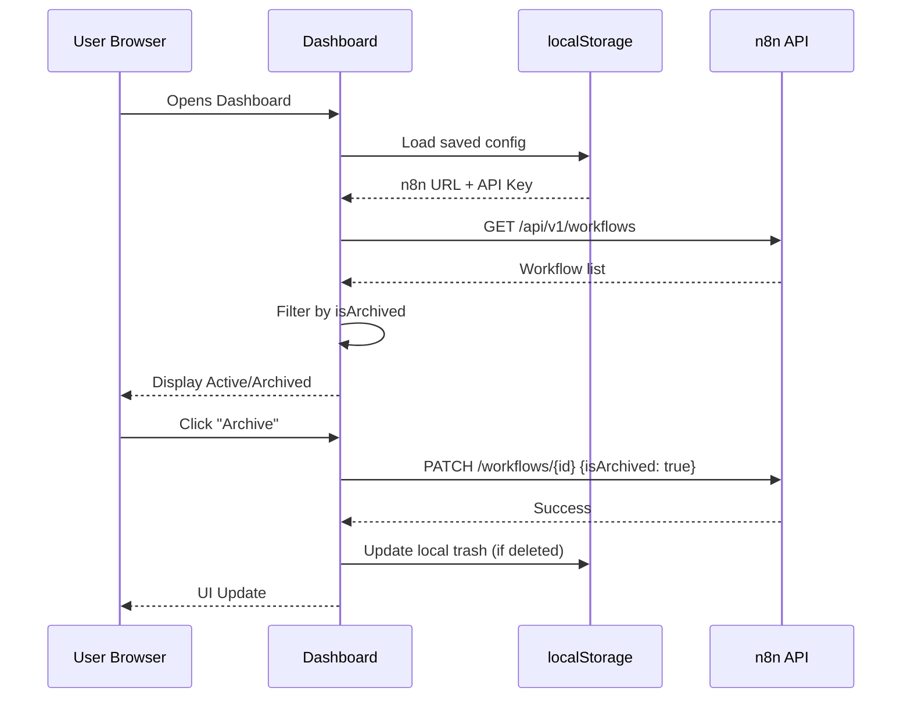
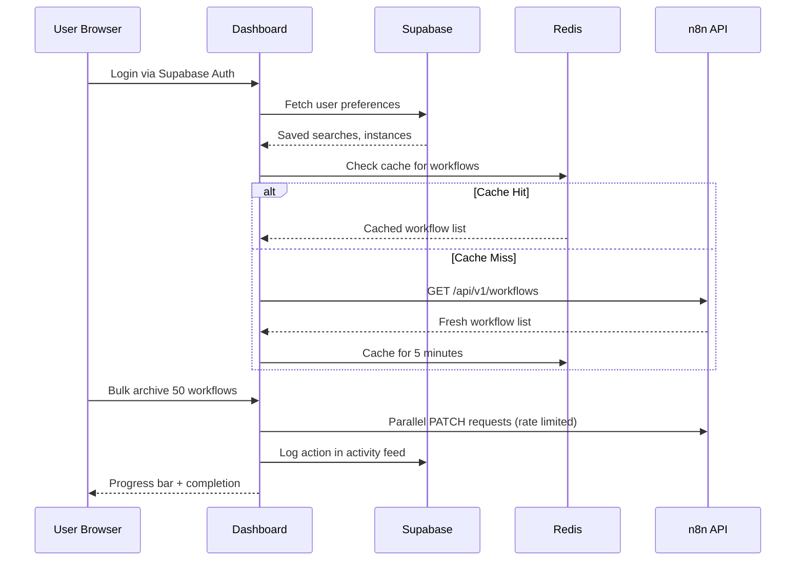
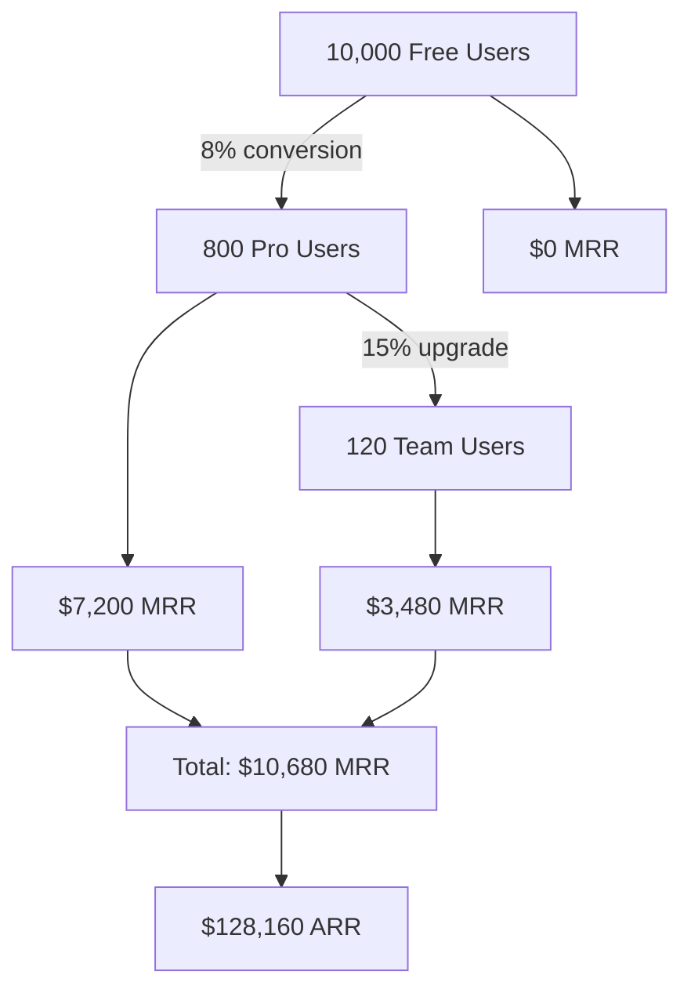
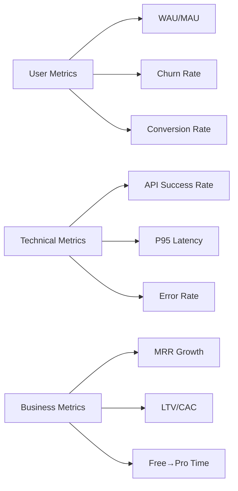
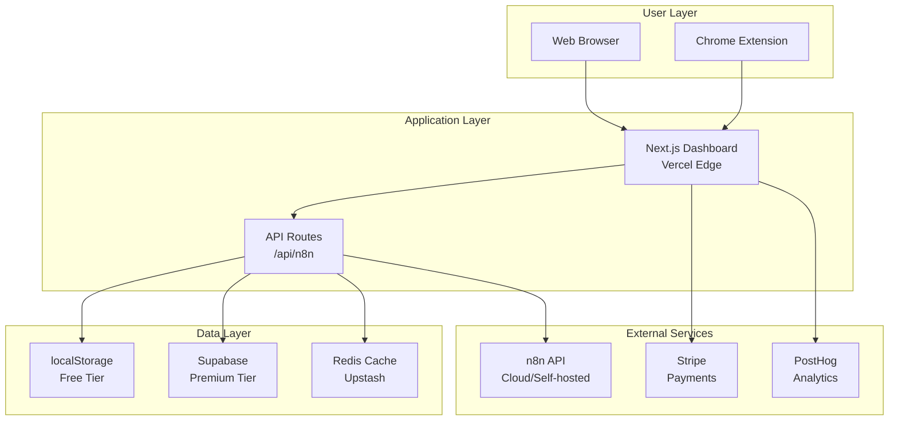
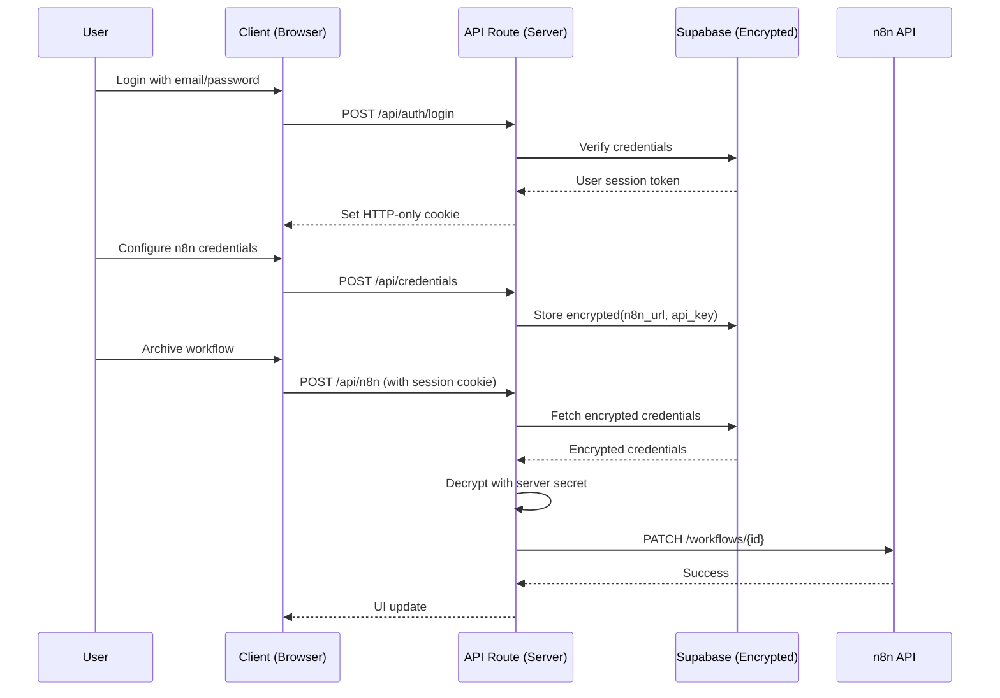
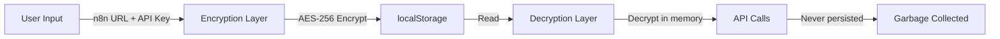

# n8n Workflow Manager: Zero to One Execution Plan

## Executive Summary

**Product Name**: FlowVault (working title)  
**Value Proposition**: Advanced workflow lifecycle management for n8n that provides archive/restore capabilities, bulk operations, and enhanced workflow organization—features missing from n8n's native UI.

**Target Market**: n8n power users, automation agencies, and teams managing 50+ workflows

**Go-to-Market Strategy**: Dual-platform launch (Chrome Extension + Web Dashboard) with freemium model

---

## 1. Product Requirements Document (PRD) & Core Logic

### 1.1 Core Value Proposition

> "Organize, archive, and manage n8n workflows at scale with a purpose-built interface that works everywhere—whether you're on n8n Cloud or self-hosted."

**Key Differentiators**:

- ✅ Native `isArchived` field support (perfect sync with n8n)
- ✅ Multi-platform (Chrome extension + standalone web app)
- ✅ Works with ANY n8n instance (cloud, self-hosted, any version)
- ✅ Local trash functionality (safety net before permanent deletion)
- ✅ Bulk operations (archive 50 workflows in one click)

### 1.2 MVP Scope (Launch in 6-8 weeks)

#### Must-Have Features (Free Tier)

**Core Workflow Management**:

- [x] View active workflows (already built)
- [x] View archived workflows (already built)
- [x] Archive/unarchive single workflows (already built)
- [x] Local trash with restore capability (already built)
- [x] Search workflows by name (already built)
- [ ] Basic filtering (by active status)
- [ ] Connection setup UI (n8n URL + API key)

**Chrome Extension Specific**:

- [ ] Popup dashboard (reuse existing Next.js UI)
- [ ] Quick archive from n8n's workflow list
- [ ] Keyboard shortcuts (Ctrl+Shift+A to archive)

**Web Dashboard Specific**:

- [x] Standalone Next.js app (already built)
- [ ] One-click deployment to Vercel
- [ ] Mobile-responsive design

#### Nice-to-Have Features (Premium Tier)

**Advanced Operations**:

- [ ] Bulk archive (select 50+ workflows)
- [ ] Bulk tag management
- [ ] Bulk activate/deactivate
- [ ] Smart folders (organize by tags, status, etc.)
- [ ] Workflow templates library
- [ ] Duplicate workflows across instances

**Enhanced Discovery**:

- [ ] Advanced search (by tags, nodes used, last edited)
- [ ] Saved filters/views
- [ ] Workflow dependency mapping
- [ ] Execution history integration

**Team Features**:

- [ ] Multi-instance management (switch between n8n servers)
- [ ] Shared trash (team-wide recovery)
- [ ] Activity log (who archived what)
- [ ] Role-based access

**Analytics**:

- [ ] Workflow usage stats
- [ ] Archive trends
- [ ] Storage optimization suggestions

### 1.3 User Stories

**Primary Persona**: Sarah, Automation Engineer at a SaaS company

- Manages 200+ n8n workflows
- Needs to archive old campaigns without losing data
- Wants to quickly find and restore workflows

**User Story Map**:

```
🎯 Goal: Organize workflows
├─ As a power user
│  ├─ I want to archive old workflows
│  │  └─ So my active list stays clean
│  ├─ I want to bulk archive by tag
│  │  └─ So I can organize seasonal campaigns
│  └─ I want a safety net before deletion
│     └─ So I can recover accidental deletes
├─ As an agency owner
│  ├─ I want to manage multiple client instances
│  │  └─ So I can switch contexts easily
│  └─ I want to see who made changes
│     └─ So I can audit team activity
└─ As a Chrome user
   ├─ I want archive buttons in n8n's UI
   │  └─ So I don't need a separate tab
   └─ I want keyboard shortcuts
      └─ So I can work faster
```

### 1.4 Success Metrics (North Star)

**Primary**: Weekly Active Users (WAU) - target 500 in first 3 months  
**Secondary**: Conversion rate (Free → Paid) - target 8-12%  
**Indicator**: Average workflows managed per user - target 75+

---

## 2. Technical Architecture & Infrastructure

### 2.1 Modern Tech Stack



#### Detailed Stack Breakdown

**Frontend**:

- **Next.js 14** (App Router) - Already implemented, SSR + API routes
- **React 19** - Already using, component architecture in place
- **TypeScript** - Type safety, already configured
- **Tailwind CSS v4** - Already styled, modern design system
- **Chrome Extension Manifest V3** - NEW, for extension version

**Backend** (Serverless):

- **Next.js API Routes** - Already have `/api/n8n` proxy
- **Vercel Edge Functions** - For global low-latency
- **Supabase** (Premium tier only) - For multi-device sync
  - Auth (if needed for team features)
  - PostgreSQL (for user preferences, saved searches)
  - Row Level Security (RLS)

**Storage Strategy**:

- **Free Tier**: 100% `localStorage` (already implemented)
- **Premium Tier**: Supabase for cross-device sync + Redis for caching

**External Services**:

- **n8n API** - Core integration (already working)
- **Stripe** - Subscription management
- **PostHog** - Product analytics (open-source alternative to Mixpanel)
- **Sentry** - Error tracking

### 2.2 Infrastructure Plan

#### Deployment Strategy

**Web Dashboard**:

```yaml
Platform: Vercel
- Auto-deploy from GitHub main branch
- Preview deployments for PRs
- Edge functions for API routes
- Global CDN (200+ locations)

Environments:
- Production: app.flowvault.io
- Staging: staging.flowvault.io
- Development: Local (npm run dev)
```

**Chrome Extension**:

```yaml
Platform: Chrome Web Store
- Manual submission (review process 3-5 days)
- Rollout strategy: 10% → 50% → 100%
- Auto-update enabled

Distribution:
- Chrome Web Store (primary)
- GitHub releases (for self-hosters)
- Unlisted version (for beta testers)
```

#### CI/CD Pipeline



**GitHub Actions Workflows**:

1. **Test & Lint** (on all PRs):

   - TypeScript type check
   - ESLint
   - Unit tests (Vitest)
   - E2E tests (Playwright)

2. **Build Extension** (on tag):

   - Bundle for Chrome Web Store
   - Create signed ZIP
   - Upload to GitHub releases

3. **Deploy Web** (on main push):
   - Auto-deploy to Vercel
   - Run post-deployment smoke tests

### 2.3 Data Flow Architecture

#### Free Tier (Local-First)



#### Premium Tier (Cloud-Sync)



### 2.4 Chrome Extension Architecture

**Manifest V3 Structure**:

```typescript
// manifest.json
{
  "manifest_version": 3,
  "name": "FlowVault for n8n",
  "version": "1.0.0",
  "permissions": ["storage", "activeTab"],
  "host_permissions": ["https://*/*"],
  "action": {
    "default_popup": "popup.html" // Your Next.js dashboard
  },
  "content_scripts": [{
    "matches": ["https://*.n8n.cloud/*", "https://*.n8n.io/*", "http://*/*"],
    "js": ["content.js"] // Inject archive buttons
  }],
  "background": {
    "service_worker": "background.js"
  }
}
```

**Component Reuse Strategy**:

- **Popup**: Reuse entire Next.js dashboard (bundle with Webpack)
- **Content Script**: Lightweight JS to inject archive buttons into n8n UI
- **Background Worker**: Handle API calls, avoid CORS

---

## 3. Monetization & Feature Segmentation

### 3.1 Freemium Strategy (Drive Adoption)

**Philosophy**: Give users enough value to fall in love, withhold scale and convenience for premium.

**Free Tier Features**:
✅ **Core Workflow Management**

- Archive/unarchive workflows (unlimited)
- View active & archived lists
- Local trash with restore
- Search by name
- Manage 1 n8n instance
- Chrome extension (basic features)

✅ **Limits** (to encourage upgrade):

- No bulk operations (1 workflow at a time)
- No saved searches/filters
- No cross-device sync
- Basic support (community forum only)

**Free Tier Revenue Model**: **$0**  
**Acquisition Goal**: 10,000 free users in 6 months

### 3.2 Premium Strategy (High-Value Features)

**Premium Tier Features**:

🚀 **Power Operations**

- ✨ Bulk archive/restore (up to 500 at once)
- ✨ Bulk tag management
- ✨ Bulk activate/deactivate
- ✨ Smart folders & custom views
- ✨ Workflow templates library

🔍 **Advanced Discovery**

- ✨ Advanced search (tags, nodes, execution history)
- ✨ Saved filters (unlimited)
- ✨ Workflow dependency mapping
- ✨ Quick switch between instances

☁️ **Cloud Sync**

- ✨ Cross-device sync (trash, preferences, saved searches)
- ✨ Multi-instance management (unlimited)
- ✨ Team activity log
- ✨ Priority support (24-hour response)

📊 **Analytics** (Premium Plus)

- ✨ Workflow usage analytics
- ✨ Archive trends & insights
- ✨ Storage optimization recommendations
- ✨ Custom reports

### 3.3 Pricing Model & Psychological Strategy

**Tiered SaaS Model** (Monthly/Annual options)

```
┌─────────────────────────────────────────────────────┐
│  FREE TIER                                          │
│  $0/month                                           │
│  ├─ Unlimited archive/restore                       │
│  ├─ 1 n8n instance                                  │
│  ├─ Local trash                                     │
│  └─ Community support                               │
│                                                      │
│  Perfect for: Individual users, small teams         │
└─────────────────────────────────────────────────────┘

┌─────────────────────────────────────────────────────┐
│  PRO TIER ⭐ Most Popular                           │
│  $9/month or $84/year (30% savings)                 │
│  ├─ Everything in Free +                            │
│  ├─ Bulk operations (500 workflows)                 │
│  ├─ Advanced search & filters                       │
│  ├─ Cloud sync                                      │
│  ├─ 5 n8n instances                                 │
│  └─ Priority support (24h response)                 │
│                                                      │
│  Perfect for: Power users, automation engineers     │
└─────────────────────────────────────────────────────┘

┌─────────────────────────────────────────────────────┐
│  TEAM TIER                                          │
│  $29/month or $276/year (20% savings)               │
│  ├─ Everything in Pro +                             │
│  ├─ Unlimited n8n instances                         │
│  ├─ Team activity log                               │
│  ├─ Role-based access                               │
│  ├─ Analytics & insights                            │
│  ├─ Custom workflows library                        │
│  └─ Dedicated support (12h response)                │
│                                                      │
│  Perfect for: Agencies, teams managing clients      │
└─────────────────────────────────────────────────────┘

┌─────────────────────────────────────────────────────┐
│  ENTERPRISE (Custom)                                │
│  Contact sales                                      │
│  ├─ Everything in Team +                            │
│  ├─ SSO/SAML authentication                         │
│  ├─ Custom integrations                             │
│  ├─ SLA guarantees                                  │
│  ├─ Dedicated account manager                       │
│  └─ White-label options                             │
└─────────────────────────────────────────────────────┘
```

#### Pricing Psychology Rationale

**$9 for Pro Tier**:

- **Anchoring**: Just below $10 (feels like "single digits")
- **Coffee Comparison**: "Less than 3 coffees/month"
- **Competitor Analysis**: Most n8n tools charge $15-49
- **Value Perception**: Saves 2+ hours/month = $18-60 in time

**$29 for Team Tier**:

- **3x multiplier**: Clear value jump from Pro
- **Per-seat illusion**: Feels like "$10/user for 3 users"
- **Agency sweet spot**: Agencies bill $150/hour, this saves 1 hour = ROI is obvious

**Annual Discount (20-30%)**:

- **Lock-in strategy**: Reduce churn by committing users
- **Cash flow**: Get 12 months revenue upfront
- **Psychological win**: Users feel they're getting a "deal"

### 3.4 Conversion Funnel Strategy



**Conversion Tactics**:

1. **In-App Prompts** (context-aware):

   - User tries bulk archive → "Unlock bulk operations with Pro"
   - User has 3+ instances → "Manage unlimited instances with Team"
   - After 10 archives → "Saved 20 minutes! Upgrade to save hours"

2. **Time-Limited Trials**:

   - 14-day Pro trial (no credit card required)
   - Full feature access during trial
   - Gentle reminders at day 7, 12, 14

3. **Usage-Based Triggers**:
   - Archive 50+ workflows in free tier → show upgrade prompt
   - Search 10 times in a day → "Save this search with Pro"

### 3.5 Revenue Projections (Conservative)

**Year 1 Goals**:

| Month | Free Users | Pro Users | Team Users | MRR     | ARR      |
| ----- | ---------- | --------- | ---------- | ------- | -------- |
| M1-3  | 1,000      | 50        | 5          | $595    | -        |
| M6    | 5,000      | 300       | 20         | $3,280  | -        |
| M12   | 10,000     | 800       | 120        | $10,680 | $128,160 |

**Break-even Analysis**:

- Monthly costs: ~$200 (Vercel Pro, Supabase, tools)
- Break-even: 25 Pro users ($225 MRR)
- **Expected break-even: Month 2**

---

## 4. Operational Governance & Limits

### 4.1 Technical Constraints & Rate Limiting

#### n8n API Rate Limits

**n8n Cloud**:

- 120 requests/minute per API key
- Burst: 200 requests in 10 seconds

**Our Strategy**:

```typescript
// Sliding window rate limiter (client-side)
class RateLimiter {
  private queue: Array<() => Promise<any>> = [];
  private processing = false;

  async enqueue(fn: () => Promise<any>) {
    this.queue.push(fn);
    if (!this.processing) this.process();
  }

  private async process() {
    this.processing = true;
    while (this.queue.length > 0) {
      const batch = this.queue.splice(0, 10); // 10 concurrent
      await Promise.all(batch.map((fn) => fn()));
      await sleep(600); // 100 requests/minute
    }
    this.processing = false;
  }
}
```

**Bulk Operation Limits**:

- **Free**: 1 workflow at a time (no rate limiting needed)
- **Pro**: 500 workflows/operation, processed in batches of 10
- **Team**: 2,000 workflows/operation, batches of 20

#### Our Internal Rate Limits

**API Routes** (`/api/n8n`):

```typescript
// Vercel Edge rate limiting
import { Ratelimit } from "@upstash/ratelimit";
import { Redis } from "@upstash/redis";

const ratelimit = new Ratelimit({
  redis: Redis.fromEnv(),
  limiter: Ratelimit.slidingWindow(100, "1 m"), // 100 req/min
  prefix: "flowvault",
});

// Per user limits
const limits = {
  free: "20 requests/minute",
  pro: "100 requests/minute",
  team: "500 requests/minute",
};
```

**Storage Limits**:

- **localStorage**: 10MB (browser limit)
  - Trash: Max 100 workflows
  - Auto-cleanup: Delete oldest after 30 days
- **Supabase** (Premium):
  - User preferences: 1MB/user
  - Activity log: 10,000 events/user
  - Auto-archive logs older than 90 days

### 4.2 Security & Compliance

#### Data Security

**API Key Storage**:

```typescript
// FREE TIER: localStorage (encrypted in transit via HTTPS)
localStorage.setItem("n8n_api_key", apiKey); // ⚠️ Visible in DevTools

// PREMIUM: Supabase (encrypted at rest)
await supabase.from("user_credentials").insert({
  user_id: userId,
  encrypted_key: encrypt(apiKey, userSecret),
});
```

**Best Practices**:

- ✅ Never log API keys
- ✅ HTTPS-only (enforce in production)
- ✅ Content Security Policy (CSP) headers
- ✅ No inline scripts (Chrome extension requirement)

#### Compliance Basics

**GDPR Compliance** (for EU users):

- ✅ Clear privacy policy
- ✅ Data export functionality
- ✅ Right to deletion (1-click account delete)
- ✅ Cookie consent banner
- ✅ Data processing agreement (for Team tier)

**Required Legal Pages**:

- Privacy Policy
- Terms of Service
- Cookie Policy
- Acceptable Use Policy

**Data Retention**:

- Free tier: Local only, user controls deletion
- Premium: 90-day activity log, auto-delete after
- Deleted accounts: Purge all data within 30 days

#### Chrome Web Store Requirements

**Privacy Disclosure**:

```
FlowVault collects:
- n8n instance URL and API key (stored locally)
- Usage analytics (via PostHog, anonymized)
- Error logs (via Sentry, no PII)

We do NOT:
- Collect workflow data
- Share data with third parties
- Access n8n workflows without user action
```

**Permissions Justification**:

- `storage`: Save user preferences
- `activeTab`: Read current n8n page for context
- `host_permissions`: Make API calls to user's n8n instance

### 4.3 Operational Monitoring

**Key Metrics to Track**:



**Dashboard Setup** (PostHog):

- User cohorts (free vs. paid)
- Feature usage (which features drive conversion?)
- Funnel analysis (signup → first archive → upgrade)
- Retention curves

**Alerting** (Sentry + Vercel):

- Error rate > 5% → Slack alert
- API latency > 2s → Email alert
- Churn spike > 20% → Founder alert

### 4.4 Support Strategy

**Free Tier**:

- Community forum (GitHub Discussions)
- Documentation site
- Video tutorials (YouTube)
- Response time: Best effort (24-72 hours)

**Pro Tier**:

- Email support (support@flowvault.io)
- Priority queue
- Response time: 24 hours

**Team Tier**:

- Dedicated Slack channel (optional)
- Video call troubleshooting
- Response time: 12 hours

**Enterprise**:

- Dedicated account manager
- Custom SLA (4-hour response)
- Quarterly business reviews

### 4.5 Incident Response Plan

**Severity Levels**:

| Level | Definition          | Response Time | Example             |
| ----- | ------------------- | ------------- | ------------------- |
| P0    | Service down        | 15 min        | Web app won't load  |
| P1    | Core feature broken | 2 hours       | Archive not working |
| P2    | Minor issue         | 1 day         | UI glitch           |
| P3    | Enhancement         | 1 week        | Feature request     |

**Runbook for P0**:

1. Auto-alert via Vercel/Sentry
2. Check status page (status.flowvault.io)
3. Rollback to last known good version
4. Post incident update every 30 min
5. Post-mortem within 48 hours

---

## 5. Launch Timeline (8-Week Sprint)

### Week 1-2: Foundation

- [ ] Finalize branding (logo, name, colors)
- [ ] Set up domain + hosting
- [ ] Configure Stripe integration
- [ ] Create landing page (Framer/Webflow)
- [ ] Write legal pages (Privacy, ToS)

### Week 3-4: Chrome Extension MVP

- [ ] Convert Next.js to extension popup
- [ ] Build content script for n8n page injection
- [ ] Implement keyboard shortcuts
- [ ] Test on Cloud + self-hosted n8n
- [ ] Submit to Chrome Web Store (unlisted)

### Week 5-6: Premium Features

- [ ] Implement Supabase auth
- [ ] Build bulk operations UI
- [ ] Add saved searches
- [ ] Set up PostHog analytics
- [ ] Create upgrade prompts

### Week 7: Beta Testing

- [ ] Invite 50 beta users
- [ ] Collect feedback via Typeform
- [ ] Fix critical bugs
- [ ] Record demo videos

### Week 8: Launch 🚀

- [ ] Publish Chrome extension (public)
- [ ] Launch on Product Hunt
- [ ] Post in n8n community forum
- [ ] Share on Twitter/LinkedIn
- [ ] Enable Stripe billing

---

## 6. Risk Mitigation

### Technical Risks

| Risk                    | Probability | Impact   | Mitigation                              |
| ----------------------- | ----------- | -------- | --------------------------------------- |
| n8n API changes         | Medium      | High     | Version detection, graceful degradation |
| Chrome policy violation | Low         | Critical | Legal review before submission          |
| Rate limiting           | Medium      | Medium   | Client-side queue, user education       |
| CORS issues             | Low         | Medium   | API proxy via Vercel                    |

### Business Risks

| Risk                    | Probability | Impact   | Mitigation                            |
| ----------------------- | ----------- | -------- | ------------------------------------- |
| Low conversion          | Medium      | High     | A/B test pricing, extend trial        |
| Churn spikes            | Medium      | High     | Exit surveys, churned user interviews |
| n8n builds same feature | Low         | Critical | Move fast, add unique value           |
| Copycat competitors     | High        | Medium   | Focus on execution & support          |

---

## Appendix: Technical Diagrams

### System Architecture Overview



---

## 7. Security Enhancements for B2C Production

### Critical Security Implementation (Pre-Launch Requirements)

**Current Security Status (Testing Phase)**:

- ✅ Device-isolated storage (localStorage per browser)
- ✅ HTTPS encryption in transit
- ❌ No user authentication
- ❌ Credentials stored in plain text (visible in browser DevTools)
- ❌ Vulnerable to XSS attacks

**Required for B2C Launch**:

### 7.1 Option 1: Session-Based Authentication (RECOMMENDED)

**Implementation**: Secure server-side credential storage with user authentication

**Architecture**:



**Implementation Steps**:

1. **Authentication Layer** (Supabase Auth):

```typescript
// /api/auth/login/route.ts
import { createClient } from "@supabase/supabase-js";

export async function POST(req: Request) {
  const { email, password } = await req.json();
  const supabase = createClient(
    process.env.SUPABASE_URL!,
    process.env.SUPABASE_KEY!
  );

  const { data, error } = await supabase.auth.signInWithPassword({
    email,
    password,
  });

  if (error) return Response.json({ error }, { status: 401 });

  // Set HTTP-only cookie
  const response = Response.json({ success: true });
  response.headers.set(
    "Set-Cookie",
    `session=${data.session.access_token}; HttpOnly; Secure; SameSite=Strict; Path=/`
  );
  return response;
}
```

2. **Credential Storage** (Server-Side Encryption):

```typescript
// /api/credentials/route.ts
import { encrypt, decrypt } from "@/lib/crypto";

export async function POST(req: Request) {
  const session = await getSession(req); // From cookie
  if (!session)
    return Response.json({ error: "Unauthorized" }, { status: 401 });

  const { n8nUrl, apiKey } = await req.json();

  // Encrypt with server-side secret
  const encrypted = {
    url: encrypt(n8nUrl, process.env.ENCRYPTION_KEY!),
    key: encrypt(apiKey, process.env.ENCRYPTION_KEY!),
  };

  await supabase.from("user_credentials").upsert({
    user_id: session.userId,
    encrypted_n8n_url: encrypted.url,
    encrypted_api_key: encrypted.key,
  });

  return Response.json({ success: true });
}
```

3. **Middleware** (Session Validation):

```typescript
// middleware.ts
import { NextResponse } from "next/server";

export async function middleware(req: Request) {
  const cookie = req.headers.get("cookie");
  const session = parseSessionCookie(cookie);

  if (!session && req.url.includes("/api/")) {
    return Response.json({ error: "Unauthorized" }, { status: 401 });
  }

  return NextResponse.next();
}

export const config = {
  matcher: ["/api/n8n/:path*", "/api/credentials/:path*"],
};
```

**Security Benefits**:

- ✅ Credentials NEVER touch client-side
- ✅ HTTP-only cookies (immune to XSS)
- ✅ Server-side encryption at rest
- ✅ Session expiry (auto-logout)
- ✅ CSRF protection with SameSite cookies

**Implementation Timeline**: 2-3 weeks  
**Complexity**: High  
**Cost**: Supabase Pro required (~$25/month)

---

### 7.2 Option 3: Client-Side Encryption + Browser Storage

**Implementation**: Encrypt credentials before storing in localStorage

**Architecture**:



**Implementation Steps**:

1. **Master Password Setup**:

```typescript
// /lib/encryption.ts
import CryptoJS from "crypto-js";

export async function setMasterPassword(password: string) {
  // Derive encryption key from master password
  const key = CryptoJS.PBKDF2(password, "flowvault-salt", {
    keySize: 256 / 32,
    iterations: 10000,
  });

  sessionStorage.setItem("_fv_key", key.toString());
  return key;
}

export function encryptCredential(plaintext: string): string {
  const key = sessionStorage.getItem("_fv_key");
  if (!key) throw new Error("Not authenticated");

  return CryptoJS.AES.encrypt(plaintext, key).toString();
}

export function decryptCredential(ciphertext: string): string {
  const key = sessionStorage.getItem("_fv_key");
  if (!key) throw new Error("Not authenticated");

  const decrypted = CryptoJS.AES.decrypt(ciphertext, key);
  return decrypted.toString(CryptoJS.enc.Utf8);
}
```

2. **Credential Management**:

```typescript
// /lib/credentials.ts
export function saveCredentials(n8nUrl: string, apiKey: string) {
  const encryptedUrl = encryptCredential(n8nUrl);
  const encryptedKey = encryptCredential(apiKey);

  localStorage.setItem("n8n_url_enc", encryptedUrl);
  localStorage.setItem("n8n_key_enc", encryptedKey);
}

export function loadCredentials(): { n8nUrl: string; apiKey: string } | null {
  try {
    const encryptedUrl = localStorage.getItem("n8n_url_enc");
    const encryptedKey = localStorage.getItem("n8n_key_enc");

    if (!encryptedUrl || !encryptedKey) return null;

    return {
      n8nUrl: decryptCredential(encryptedUrl),
      apiKey: decryptCredential(encryptedKey),
    };
  } catch {
    // Decryption failed (wrong password or corrupted data)
    return null;
  }
}
```

3. **Lock Screen Component**:

```typescript
// /components/LockScreen.tsx
"use client";

export function LockScreen() {
  const [password, setPassword] = useState("");
  const [unlocked, setUnlocked] = useState(false);

  const handleUnlock = async () => {
    try {
      await setMasterPassword(password);
      const creds = loadCredentials();

      if (creds) {
        setUnlocked(true);
      } else {
        alert("Incorrect password or no credentials found");
      }
    } catch {
      alert("Failed to unlock");
    }
  };

  if (unlocked) return <Dashboard />;

  return (
    <div className="lock-screen">
      <h1>Enter Master Password</h1>
      <input
        type="password"
        value={password}
        onChange={(e) => setPassword(e.target.value)}
        placeholder="Master password"
      />
      <button onClick={handleUnlock}>Unlock</button>
    </div>
  );
}
```

**Security Benefits**:

- ✅ Credentials encrypted at rest in localStorage
- ✅ Decryption key stored in sessionStorage (cleared on tab close)
- ✅ Master password never sent to server
- ✅ Zero-knowledge architecture
- ⚠️ Still vulnerable to XSS (if attacker runs code, can read sessionStorage)

**Security Limitations**:

- ❌ Vulnerable to XSS attacks (if attacker injects script)
- ❌ Master password can be keylogged
- ❌ No server-side validation
- ❌ Users can forget master password (unrecoverable)

**Implementation Timeline**: 1 week  
**Complexity**: Medium  
**Cost**: $0 (client-side only)

---

### 7.3 Recommendation: Hybrid Approach

**For B2C Launch, implement BOTH**:

1. **Default (Free Tier)**: Option 3 (Client-Side Encryption)

   - Master password locks credentials
   - No server dependency
   - Good for privacy-conscious users

2. **Premium Tier**: Option 1 (Session-Based Auth)
   - Cloud sync of encrypted credentials
   - Multi-device access
   - Better security guarantees

**Phased Rollout**:

- **Phase 1 (Week 1-2)**: Implement Option 3 for immediate security improvement
- **Phase 2 (Week 3-5)**: Add Option 1 for premium users with Supabase integration
- **Phase 3 (Post-launch)**: Add 2FA, SSO for enterprise tier

**Additional Hardening**:

- Content Security Policy (CSP) headers
- Subresource Integrity (SRI) for CDN assets
- Rate limiting on API routes
- IP-based anomaly detection (via Vercel Analytics)
- Audit logging for sensitive operations

---

**Document Status**: Draft v1.0  
**Last Updated**: December 28, 2024  
**Next Review**: Before B2C production launch
